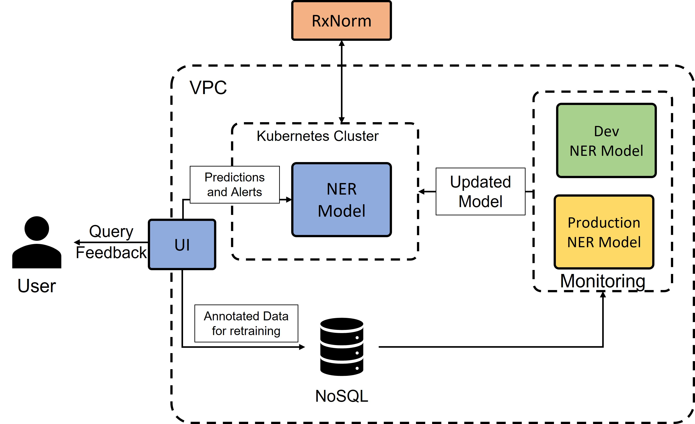

# medication_extractor
This repository was built by Erik Nyquist (enyquis1) for use in Johns Hopkins University course EN.705.603.81.FA22. The aim is to build a Named Entity Recognition and Disambiguation (NERD) model to extract medication names from text and map them to the RxNorm knowledge base.

## How to use:
Clone this repo and, if using an environment that supports "Make", run `make init` to build the virtual environment. There are a few options to explore the functionality of this repo:
* Run the jupyter notebook titled "notebooks/demo.ipynb". This will instansiate the NERD model to explore performance on unseen text.
* In the terminal, run "make serve-django". This will run the Django application which can be viewed at localhost:8000/.
* For anyone curious as the the code documentation, from the terminal run "make serve-docs". This will load the sphinx documentation from FireFox. Simply edit the Makefile to use the browser of your choice.

# System Paper
This repository was built by Erik Nyquist (enyquis1) for use in Johns Hopkins University course EN.705.603.81.FA22. In what follows, the author outlines system design requirements in order to flesh out this pilot into a production ready system.

## Problem Statement
A patient’s [Electronic Health Record (EHR)](https://www.healthit.gov/faq/what-electronic-health-record-ehr) is a digital version of a patient’s paper chart. EHRs are real-time, patient-centered records that make information available instantly and securely to authorized users. While an EHR does contain the medical and treatment histories of patients, an EHR system is built to go beyond standard clinical data collected in a provider’s office and can be inclusive of a broader view of a patient’s care. EHRs are a vital part of health IT and can: Contain a patient’s medical history, diagnoses, medications, treatment plans, immunization dates, allergies, radiology images, and laboratory and test results; Allow access to evidence-based tools that providers can use to make decisions about a patient’s care; and automate and streamline provider workflow. One of the key features of an EHR is that health information can be created and managed by authorized providers in a digital format capable of being shared with other providers across more than one health care organization. EHRs are built to share information with other health care providers and organizations – such as laboratories, specialists, medical imaging facilities, pharmacies, emergency facilities, and school and workplace clinics – so they contain information from all clinicians involved in a patient’s care.

As one can imagine, a patient’s EHR can quickly grow, as they interact with different medical providers and specialists over the course of the patient’s lifetime. As a patient ages out of pediatric care to internal medicine, relocates around the country, or changes insurance plans and thus sees different providers, an EHR will be populated with different styles of forms, documentation of episodes of care, and some records may be digital while some may be scanned or faxed from different hospital systems. This growth, while central to the concept of an EHR, makes the automation and streamlining of provider workflow a serious challenge. While a patient’s records inside a hospital system are likely in the same format (and thus easily digitized and ready for information extraction), what if a patient recently moved across the country to receive care under the nation’s best oncologist? This patient’s historical care may be in a format inaccessible to the attending physician. What care did they receive previously? What medications have they taken? Where there any surgeries or labs in the past that are relevant to providing care today? 

The task of a universal EHR information extraction system is multi-faceted. There is the raw character extraction from the document (which may involve digital representation or Optical Character Recognition (OCR) to recover text from scanned documents), the resolution of those characters (is that character a “c” or an “e”?), the extraction of the text from a document, and finally the resolution of relating extracted information into a domain knowledge base that can be leveraged by every medical provider. This pilot focuses on the last two steps, extraction from text and the resolution to a domain knowledge base.

## Decomposition

### Project Goal

This effort seeks to design a Named Entity Recognition and Disambiguation (NERD) model focused on extracting mentions of medication from text and resolving those mentions to the RxNorm Database through the [6D Framework](https://arxiv.org/abs/2202.03172#:~:text=The%206-D%20framework%20provides%20an%20end-to-end%20framework%20to,medicine%20use%20case%20is%20described%20in%20this%20paper.). [RxNorm](https://www.nlm.nih.gov/research/umls/rxnorm/index.html) provides normalized names for clinical drugs and links its names to many of the drug vocabularies commonly used in pharmacy management and drug interaction software, including those of First Databank, Micromedex, Multum, and Gold Standard Drug Database. By providing links between these vocabularies, RxNorm can mediate messages between systems not using the same software and vocabulary.  This pilot aims to demonstrate the ability of Off-The-Shelf (OTS) models to extract and disambiguate medications such that medical providers will know which medications a patient has been prescribed without the need to manually and exhaustively read the patient’s EHR and instead focus on providing the best care to the patient.

### Obstacles

Creating a NERD model on healthcare data involves a system that ingests text, classifies word tokens, and correctly unifies medication tokens to their RxNorm code before returning the output to the user. The primary challenges with creating and implementing this system are detailed below:

* Issue 1: Patient information is protected. **Implications**: Real patient records are protected under the Health Insurance Portability and Accountability Act (HIPAA) of 1996. As such, authentic EHRs may be impossible to train a model on. **Response**: There are existing datasets, such as 2009 i2b2 Medication Extraction Challenge, 2018 n2c2 Track 2: Adverse Drug Events and Medication Extraction in EHRs are available to train custom models (provided a data use agreement is signed), or MIMIC-III . An alternative is to use a pretrained model such as [Amazon Comprehend Medical]( https://deepai.org/publication/assessment-of-amazon-comprehend-medical-medication-information-extraction) or models on [HuggingFace](https://huggingface.co/kormilitzin). Each route offers its own pros and cons and should be evaluated accordingly. For this pilot, we will leverage a pre-trained spaCy model from [HuggingFace](https://huggingface.co/kormilitzin/en_core_med7_lg).

* Issue 2: Real world representations of text are dirty. **Implications**: Real world representations of text are dirty: poor image quality, skewed faxes, and the infamous quality of doctors’ handwriting are all challenges to a complete pipeline to extract and map medications from text. **Response**: This effort will assume input text to the NERD model is already clean. This effort will not focus on the OCR/character resolution challenges inherent in this issue. Should needs require implementation of a character extraction pipeline, the author recommends investigating AWS Textract as a starting point for high quality character extraction. Future discussions can be had to weigh the cost of using AWS Textract compared to the development of a custom extraction service.

* Issue 3: Feature Selection. **Implications**: Selecting features for Named Entity Recognition are many and varied. Choosing the most appropriate method heavily relies on the machine learning architecture chosen to solve the problem. **Response**: Deep learning methods, specifically deep neural nets and transformers, have shown high performance on NER tasks while easing development requirements as they learn features automatically. However, there is an ethics question that must be addressed, as these approaches make explainability difficult and could introduce harmful bias.

### Workflow

An initial workflow diagram was developed to demonstrate dataflow of the NERD system in Figure 1. 

All model resources are to be hosted inside a Virtual Private Cloud (VPC). A user interface (UI) is accessible to the end user to submit queries as well as provide feedback to annotations to improve model performance. The deployed NER model is deployed to a Kubernetes cluster to provide stability and scalability to provide predictions. The deployed NER model communicates with RxNorm to perform the resolution of medication mentions. User feedback (corrected annotations) are stored in a NoSQL database. A monitoring service checks performance of the deployed (production) NER model and a development NER model on the corrected annotations. As the monitoring service determines that the development NER model outperforms the production model, the development model is replaced as the production model to ensure that the system remains performant.

## Domain Expertise

### Medical Expertise

As this effort seeks to extract medications and map them to their RxNorm codes to support medical providers, ideally this effort should have at a minimum a physician/RN consult on the quality of the output. If the budget and development timeline allow, the author encourages soliciting feedback from physicians/RNs in several medical domains that see patients across the socioeconomic spectrum. This will minimize the chances that the solution works well only for certain patient demographics or treatment regimens.

The author also recommends the expertise of RNs to identify medications in the event a custom dataset is developed. While there are techniques such as distant supervision to generate training data, it is wise to get a “thumbs up” from a medical provider prior to training on any custom datasets.

As for those whose expertise should not be included are those in the insurance industry or pharmaceutical development. The chief concern being any undue influence on what is considered medication and any preferences there may be. While subject matter experts from these fields should be excluded from model development, it would be wise for members of the SME team to include peer-reviewed sources on any new medications developed so as to include new medication names as valid targets for the model.

In the event medical subject matter experts cannot be secured for this effort, the SMEs employed should at a minimum have extensive practical or educational experience in the field of medicine or pharmacology.

Due to budget and timeline constraints, this pilot effort will forego any subject matter experts and instead leverage the pre-trained HuggingFace model which was trained on the MIMIC-III dataset.

### Relevant Features

As a sequence labeling task leveraging deep learning, the task of feature selection is much simpler. Tokens will be classified as either “Not a medication” or “medication”. Features will be vectorized representations of text. For those curious, the specifics of the HuggingFace model and its encoding scheme are listed [here](https://huggingface.co/kormilitzin/en_core_med7_lg/blob/main/config.cfg). In the event a custom model is implemented, there are many state-of-the-art architectures available in the literature that provide a good start point for development.

### Approach

The aim of the NERD model is simple: maximize the precision, recall, and F1 scores on a test dataset. However, in the event a custom model is implemented and maximizing precision, recall, and F1 proves challenging, the author recommends that the aim should be to maximize recall (at the cost of low precision) then filter out erroneous matches (to improve precision) in a two-stage model approach. That is to say, while the NERD model may be visually depicted as one unit, developers are encouraged to consider multi-model pipelines to improve overall performance.

## Data

### Data Collection

As mentioned previously, there are several available datasets for medication extraction from patient EHRs. This pilot effort leveraged a pre-trained model and thus did not need to collect data, but an overview of data sources is discussed below:

* 2009 i2b2 Medication Extraction Challenge Dataset: This dataset comprises of 268 EHRs with a total of 9,689 sentences. This dataset is available from Harvard Medical School after a data sharing agreement is [signed](https://portal.dbmi.hms.harvard.edu/projects/n2c2-nlp/).

* 2018 n2c2 Track 2: Adverse Drug Events and Medication Extraction in EHRs: This dataset comprises of 55,995 sentences. This dataset is available from Harvard Medical School after a data sharing agreement is [signed](https://portal.dbmi.hms.harvard.edu/projects/n2c2-nlp/).

* MIMIC-III: MIMIC-III is a publicly available database with over 40,000 de-identified patient records spanning over a decade. Access can be granted via AWS.

Should a custom model be built, it is recommended to use the MIMIC-III dataset for its size as many deep learning models benefit from large amounts of data. As an added benefit, this will allow direct comparison to the HuggingFace model, which was trained on MIMIC-III.

### Data Storage

As no data will be collected for this pilot effort, there is no need for custom data storage. However, it is recommended that in a production environment to store the predicted medications and any human corrected annotations as a means for further model training. Simply storing the sentence sequence, the predicted annotations, and the human corrected annotations is sufficient. A simple storage solution such as MongoDB or even simpler AWS S3 would be suitable as both scale storage requirements and very little manipulation of data is required to train and validate a custom model.

### Data Definition

Data fed to the model in production is a simple string object, without annotations. The model will handle all preprocessing.

### Data Outputs

Outputs from the pre-trained model are (string, label) pairs. We filter labels to limit output to DRUG entities, as the pre-trained model can identify other medical entities such as dosage. If a custom model is implemented, outputs should be predicted labels for each token in the sentence which can be filtered appropriately to retrieve the medication mention from the text.

### Data Transformation

In sequence labeling tasks, data needs to be encoded in order for the NER model to ingest the data. Leveraging the HuggingFace model abstracts the encoding for the developer and for those curious they can inspect the [configuration file]( https://huggingface.co/kormilitzin/en_core_med7_lg/blob/main/config.cfg) to compare neural architectures when developing a custom model.

### Data Quality

As no data was collected for this pilot, there isn’t much to discuss regarding the quality of data. The leveraged HuggingFace model was trained on MIMIC-III. MIMIC-III provides plentiful sequences to split into train, validation, and test sets should a custom model be desired. Importantly, MIMIC-III contains de-identified patient data, so the data is as reflective of data the model may see in the wild as can be obtained without partnering with a hospital system. And importantly, MIMIC-III’s data will contain the appropriate amount of medication mentions (that is to say a small amount compared to the entire vocabulary), which synthetic data may have a hard time replicating. Named Entity Recognition tasks are typically class imbalanced and if generating synthetic data it is recommended that the medication mentions not to exceed 30% of all tokens.

## Design

### Model Selection

For this pilot the “en_core_med7_lg” spaCy model hosted on HuggingFace was selected. spaCy models are well documented, powerful, have both CPU and GPU configurations, are lightweight enough for quick inference, and achieves 88-91% F1 score across the seven entity classes (depending on architecture). The “en_core_med7_lg” model is specifically optimized for CPU and quick inference and achieves 88% F1 score.

There were other considerations for pre-trained models such as Amazon Comprehend Medical. The benefit of the spaCy model is that it runs locally, doesn’t cost anything, can be used commercially, and performs just about as well or better as Amazon Comprehend Medical. Scaling is not an issue, as other technologies such as Docker and Kubernetes can handle the infrastructure scaling to serve multiple models as demand grows.

Leveraging a pre-trained model was desirable over designing a custom model for a few reasons. The first being access to EHRs, through any source, is not open access. The aim of this pilot was to deliver tangible benefit to medical providers in a rapid fashion and pre-trained models achieve state-of-the-art performance and are well documented. The second being that the resources to train state-of-the-art models aren’t something that is necessarily achievable on a local machine. It is not recommended to spend any time in research and development on designing a custom model as the spaCy model leveraged can perform online learning on new data as it is collected.

### Model Training

For this pilot, no additional training of the spaCy model was performed. Should additional training be desired, follow the spaCy documentation on how to appropriately encode inputs for the model.

### Model Evalutation

For this pilot, no additional evaluation of the spaCy model was performed. Should additional evaluation be desired, run the model on known sequences and calculate performance.

## Diagnosis

### System Failure Modes

If a medication cannot be extracted, the model will not return a prediction. Furthermore, if a medication is extracted but has been discontinued (RxNorm tracks medications that are in active use and have fallen out of use), the model will not return a prediction. The underlying assumption being that if a patient was prescribed a medication that is not longer active, the patient is unlikely to still be taking that medication and thus can be safely ignored as part of a medical provider’s understanding of a patient’s medical history. The model will only return a prediction of a medication could be extracted and it could be resolved to the RxNorm database. There is a chance that the medication has not yet been ingested by RxNorm, but the author sees this as an unlikely situation as the list of FDA approved medications doesn’t change that rapidly.

### Bias

The largest concern for bias, bias from a patient’s socioeconomic characteristics, is fortunately resolved as the MIMIC-III database de-identifies Personally Identifiable Information (PII). So the model will not make predictions of what medications are present in a patient’s chart due to any socioeconomic characteristics.

One possible source of bias is due to the fact that MIMIC-III contains a significant portion of records from emergency rooms and ICUs. This may lead to an expectation that, given an EHR, there should be a higher percentage of medication tokens in the text as patients in emergency rooms and ICUs may be on more medications (and more specialized medications) than a patient in another setting. As en_core_med7_lg’s precision, recall, and F1 score are in the high 80th percentiles and the fact that MIMIC-III also contains “regular” patient visits, this concern may be alleviated. It may in fact be a better failure to have a false positive (a medication not taken by the patient) than a medication missed by the model. The concern that remains is that the system has too many false positives and thus medical providers distrust the output, though this must be monitored in a deployed setting to be certain.

### Ethics

As this system extracts and disambiguates medications in text and is only available to medical providers, there is a low chance for ethics violations. Medical providers already have access to the patient’s EHR and handling of this data is directed under HIPAA. This system simply aids the medical provider in quickly understanding the content of an EHR. Furthermore, as the system simply extracts and disambiguates medications vice making treatment recommendations or alerting to potential adverse effects, this system doesn’t remove the human expert from the process. As the medical provider is still the primary decision-maker, there is little chance that this system hurts patients.

## Deployment

### Deployment Strategy

In a production environment, this model will be containerized with Docker and deployed to a Kubernetes cluster to manage scaling to meet customer needs, shown in the figure below. For the purposes of this pilot, a simple Django application was put together with a simple interface for the user to input text and get extractions back to demo the capabilities of the system.

### Process Monitoring/Data Drift

In a production environment, the model will utilize a human-in-the-loop interface to alert medical providers to low confidence extractions. After validating the extraction or providing the correct annotation, this can be stored for model retraining. Additionally, customers will have a UI where they can track the number of documents that have been processed by the system and address any documents that have been selected for human review (either due to an auditing process or low confidence predictions).

It is important to note that if the model continuously and increasingly makes low confidence predictions (indicating some significant and sudden model drift/degradation) it may be necessary to train a new model on the best available data source at the time. It is recommended that a new system design be completed in this event to reassess model parameters and data sources.

## Conclusion

In summary, a Named Entity Recognition and Disambiguation (NERD) model was developed with the 6D Framework to extract medications from text to automate the review of patient EHRs by medical providers. This system leverages the en_core_med7_lg spaCy model from HuggingFace and the RxNorm knowledge base for state-of-the-art performance and relating extractions back to an industry standard database. The processes for data preprocessing, storage requirements, and data flow were outlined for both the pilot project and how the project might expand in the future. A simple Django application was developed to explore performance on unseen text.
